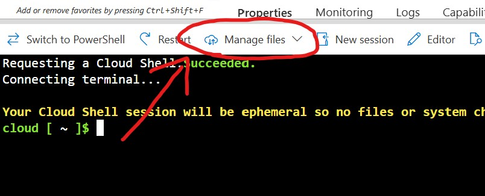

# Scenario Setup

These instructions explain how to setup the scenario for today's exercise.

First you'll need to setup an ACG Cloud Sandbox for Azure (as we have done on previous workshops).

Once the sandbox is setup, login to the Azure portal and navigate to your resource group:


From here you'll want to create a **Powershell** Cloud Shell. When the cloud shell is ready it should look something like this:



From here click the **Manage Files** to upload the following scripts:
* `scenario.bicep`
* `deploy_scenario.ps1`
* `db_setup.sql`

You can then create your scenario resources by running:
```
./deploy_scenario.ps1
```

You'll then be prompted to provide your resource group name, a prefix & a database password.
* Please note that the database password must respect [the complexity conditions listed here](https://learn.microsoft.com/en-us/sql/relational-databases/security/password-policy?view=sql-server-ver16#password-complexity)
* There's a simple Terraform script in this folder for generating a suitable password (just run `terraform init` and `terraform apply` in this folder to produce the password)

Once the deploy script has finished you should see 4 resources in your resource group. Navigate to the **App Service** and open up the page for the website:


It may take some time but eventually the page should load saying that it has successfully connected to the database.

If you've got this far then congratulations! You've successfully setup the scenario and can proceed to [the main instructions here](../instructions.md)